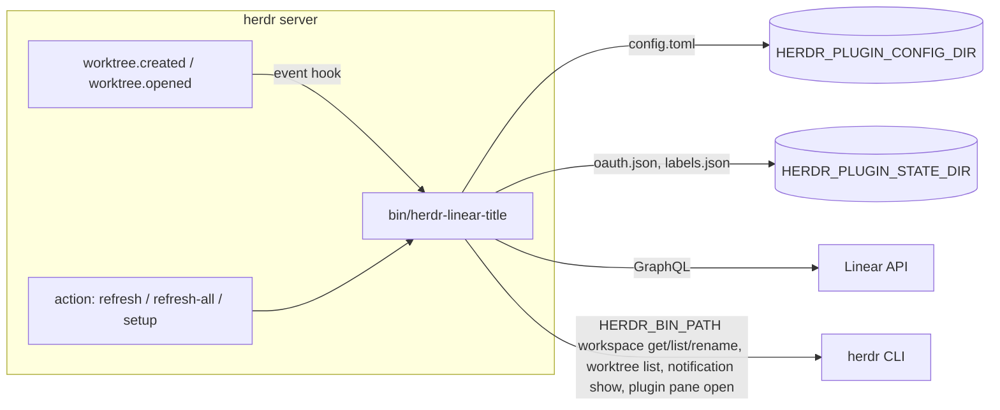

# herdr-linear-title 계획

herdr에서 worktree를 만들거나 열면, 브랜치명에서 Linear 이슈 식별자(`HOMECO-2290`)를 추출해 Linear 이슈 타이틀을 조회하고 workspace label을 `HOMECO-2290 무슨무슨 피처`로 바꾸는 herdr 플러그인.

## 1. 확정된 결정 (grill 결과)

| 항목 | 결정 |
| --- | --- |
| 인증 | Personal API key + OAuth 2.0 PKCE (사용자가 직접 만든 Linear OAuth App의 `client_id`, `client_secret` 불필요). 둘 다 1차 구현 범위 |
| 변경 대상 | Workspace label만 (tab label은 건드리지 않음) |
| 트리거 | `worktree.created`, `worktree.opened` 이벤트 자동 + 수동 액션 2개(현재 workspace / 전체 sync) |
| 브랜치 매칭 | 설정한 Team key 목록 기준, 브랜치 문자열 어디서든 대소문자 무시 매칭 |
| 런타임 | Go 단일 바이너리 (`CGO_ENABLED=0`) |
| 의존성 관리 | `flake.nix` + direnv (`.envrc`: `use flake`) |
| 설정 | `$HERDR_PLUGIN_CONFIG_DIR/config.toml` + 대화형 `setup` popup |
| 비밀 저장 | 0600 파일 (API key는 config.toml, OAuth 토큰은 state dir) |
| 덮어쓰기 | 자동 트리거는 사용자 수동 이름 보존, 수동 액션은 항상 덮어씀 |
| 실패 처리 | label 유지 + `herdr notification show` + stderr. 브랜치 패턴 미매칭은 조용히 종료 |
| 배포 | GitHub public repo, `herdr-plugin` topic, 설치 시 `[[build]]`에서 nix로 빌드 후 바이너리를 plugin root로 복사 |
| 플랫폼 | macOS, Linux (WSL 포함). Windows 미지원 |

용어: Linear에서 "프리픽스"의 정식 명칭은 **Team key**(팀 식별자). 이슈 식별자 = `{team key}-{number}`.

## 2. 검증된 사실

표기: **[실측]** = 2026-10-06 직접 실행해 확인, **[소스]** = herdr `v0.9.3` 소스 확인, **[문서]** = 공식 문서만 근거.

### 2.1 herdr 플러그인 (0.9.3)

출처: [Plugins](https://raw.githubusercontent.com/herdrdev/herdr/v0.9.3/docs/next/website/src/content/docs/plugins.mdx), [Socket API](https://raw.githubusercontent.com/herdrdev/herdr/v0.9.3/docs/next/website/src/content/docs/socket-api.mdx).

실측 환경: `XDG_CONFIG_HOME`/`XDG_STATE_HOME`을 `/tmp`로 돌린 격리 `herdr server` + 이벤트/env를 덤프하는 테스트 플러그인 + tmux에 붙인 TUI client.

- 플러그인 = `herdr-plugin.toml` manifest + argv 명령. SDK 없음. **herdr CLI 전체가 플러그인 API**이며 `HERDR_BIN_PATH`로 호출. [문서]
- 런타임 명령의 cwd = plugin root. [실측: `pwd` = `HERDR_PLUGIN_ROOT`]
- 이벤트 훅 env [실측]: `HERDR_BIN_PATH`, `HERDR_ENV=1`, `HERDR_SOCKET_PATH`, `HERDR_PLUGIN_ID`, `HERDR_PLUGIN_ROOT`, `HERDR_PLUGIN_CONFIG_DIR`(`$XDG_CONFIG_HOME/herdr/plugins/config/<id>`), `HERDR_PLUGIN_STATE_DIR`(`$XDG_STATE_HOME/herdr/plugins/<id>`), `HERDR_PLUGIN_EVENT`(`worktree.created`), `HERDR_PLUGIN_EVENT_JSON`, `HERDR_PLUGIN_CONTEXT_JSON`, `HERDR_WORKSPACE_ID`/`HERDR_TAB_ID`/`HERDR_PANE_ID`(새 worktree workspace 기준).
- 훅은 서버 프로세스가 별도 스레드로 spawn, 동시 최대 32개, stdout/stderr 64KB까지 `herdr plugin log list`에 기록. [소스: `src/app/api/plugins/runtime.rs`]
- **TUI 생성 경로도 이벤트 발생** [실측]: TUI `prefix+shift+g` overlay와 `herdr worktree create` 모두 `worktree.created` 훅 실행.
- `HERDR_PLUGIN_EVENT_JSON` 실제 형태 [실측]. 주의: envelope의 `event`는 `worktree_created`(snake_case)이고 env `HERDR_PLUGIN_EVENT`만 점 표기. 분기는 `data.type`으로 한다.
  ```json
  {"event":"worktree_created",
   "data":{"type":"worktree_created",
           "workspace":{"workspace_id":"w2","label":"homeco-9001",
                        "worktree":{"checkout_path":"/tmp/hlt/wt/repo/homeco-9001","is_linked_worktree":true,...},...},
           "worktree":{"path":"/tmp/hlt/wt/repo/homeco-9001","branch":"homeco-9001",
                       "is_detached":false,"is_linked_worktree":true,"open_workspace_id":"w2","label":"repo"}}}
  ```
- `worktree.opened` [실측]:
  - 이미 열린 worktree를 다시 open → `data.already_open: true`, `workspace.label`은 현재(수동 변경된) label.
  - workspace를 닫고 다시 open → 새 workspace id(`w2`→`w4`), `already_open: false`, **label이 자동값으로 리셋**(`custom_name`은 workspace 닫을 때 사라짐). 따라서 재오픈 시 자동 갱신이 필요하고, 플러그인 label 기록은 workspace id가 아닌 checkout path 키여야 한다.
  - 같은 checkout인데 `created`는 `/tmp/...`, `opened`는 `/private/tmp/...`(macOS symlink)로 경로 표기가 다름 → 키는 `filepath.EvalSymlinks`로 정규화.
- 기본 label [실측]: 브랜치 `homeco-9001` → `homeco-9001`; 브랜치 `sungjunyoung/homeco-9002-add-login` → `sungjunyoung-homeco-9002-add-login`(= checkout 디렉터리명 slug). 자동 갱신 가드 집합 = {branch, basename(checkout path), 플러그인이 마지막으로 쓴 label}.
- `herdr workspace rename <id> <label…>`은 `custom_name` 설정, 공백/한글 포함 긴 label 그대로 저장. [실측]
- 사이드바 [실측 + 소스 `src/client/shell/sidebar.rs:632`]: worktree 자식 행은 custom label이 없으면 브랜치명(`worktree/` 접두 제거), 있으면 label 표시. 너비 초과 시 `…`로 잘림: `HOMECO-9003 상…`. 사이드바 너비는 label에 맞춰 자동 확장되나 `ui.sidebar_max_width` 기본 36에서 멈춤 → 식별자를 앞에 두는 기본 포맷 유지, README에 `ui.sidebar_max_width` 조정 안내.
- `herdr notification show` [실측]: TUI client가 붙어 있으면 `{"shown":true}`, 없으면 `{"shown":false,"reason":"disabled"}`(exit 0). 알림은 best-effort이므로 원인은 항상 stderr(plugin log)에도 남긴다.
- Setup popup [실측]: manifest `placement = "popup"` pane을 `herdr plugin pane open --plugin <id> --entrypoint setup --focus`로 열면(CLI `--placement`에 popup 없어도 manifest 값 적용) popup이 뜨고 키 입력이 stdin으로 전달됨, `HERDR_PLUGIN_ENTRYPOINT_ID=setup` 주입. client가 없을 때도 응답은 `ok` → setup은 TUI에서 실행해야 의미 있음.
- `[[build]]` [소스: `src/cli/plugin.rs:214-254, 1328-1395`]: `plugin install` 시 **임시 디렉터리(`.tmp-install-…`)에 clone → 그 디렉터리를 cwd로 build → 최종 managed 경로로 `rename`**. build 명령은 `HERDR_*` env가 제거된 상태로 실행. `plugin link`는 build를 실행하지 않음.
- **nix `--out-link result`는 설치 후 GC root를 잃음** [실측]: `result` 생성 후 디렉터리를 이동하면 `nix-store --gc --print-roots`에서 root가 사라지고 store path가 `--print-dead`에 나타남 → 다음 `nix-collect-garbage` 때 플러그인 바이너리가 삭제될 수 있음. 해결: build에서 store의 바이너리를 plugin root의 `bin/`으로 복사.
- 복사한 Go 바이너리의 독립성 [실측]: `buildGoModule` + `CGO_ENABLED=0` 산출물은 `otool -L` 기준 시스템 라이브러리(libSystem, Security, CoreFoundation)만 링크, store 밖으로 복사해도 실행됨. (store 참조는 iana-etc/tzdata/mailcap 데이터 경로뿐이고 실행 필수 아님)
- 원격 머신(`--machine`) [소스]: 훅/액션은 이벤트를 낸 herdr 서버 프로세스가 자기 호스트에서 spawn. 원격 세션에서 쓰려면 그 호스트에 플러그인을 설치하고 config/token도 그 호스트에 둔다. 로컬 설정은 forward되지 않음. 플러그인 쪽 추가 구현 없음.

### 2.2 Linear

출처: [OAuth 2.0](https://linear.app/developers/oauth-2-0-authentication.md), [GraphQL](https://linear.app/developers/graphql.md), [API and webhooks](https://linear.app/docs/api-and-webhooks.md).

실측: 사용자가 Home:co 워크스페이스에 만든 OAuth App(redirect `http://localhost:53682/callback`)으로 throwaway 스크립트를 이용해 전체 흐름 실행.

- **PKCE 전체 흐름 동작** [실측]:
  - authorize(`scope=read`, `code_challenge_method=S256`) → localhost callback에 `code`, `state` 수신, state 일치.
  - `POST /oauth/token` form `grant_type=authorization_code, code, redirect_uri, client_id, code_verifier` → **`client_secret` 없이 200**. 응답 `token_type=Bearer`, `expires_in=86399`, `scope="read"`, access token `lin_oa…`, refresh token `lin_re…`.
  - refresh: `grant_type=refresh_token, refresh_token, client_id`만으로 200, **refresh token 회전됨**.
  - 이미 사용한 refresh token 재요청 → 200이고 **첫 refresh와 같은 새 refresh token을 돌려줌**(문서의 30분 grace 확인). 동시 refresh 경합은 치명적이지 않지만, 불필요한 호출과 grace 만료 위험을 막으려 `flock`은 유지.
  - `POST /oauth/revoke` form `token=…` → 200.
- **이슈 조회** [실측, OAuth Bearer]:
  - `issue(id:"HOMECO-2290"){identifier title}` → `{"identifier":"HOMECO-2290","title":"testflight, google play console 빌드제출"}`. 소문자 `homeco-2290`도 동일하게 조회됨.
  - 없는 이슈 → **HTTP 200** + `errors[0].extensions.code = "INPUT_ERROR"`, message `Entity not found: Issue`, `data: null`. HTTP status만으로 판단하면 안 됨.
  - **alias 다건 조회는 쓰면 안 됨**: 한 alias가 없는 이슈면 다른 alias 결과까지 포함해 `data` 전체가 `null`.
  - 대안 다건 조회 동작: `issues(filter:{team:{key:{eq:"HOMECO"}}, number:{in:[2290,2291,999999]}}, first:50){nodes{identifier title}}` → 있는 2건만 반환, 없는 것은 단순 누락.
- 권한 [문서 + 실측]: OAuth App 생성 화면(Settings → Administration → API)은 **admin만** 접근 가능(본인 `isAdmin: true` 확인, 앱 생성 완료). Personal API key는 admin이 "Member API keys"를 허용해야 member가 발급 가능. 둘 다 불가한 사용자는 플러그인 사용 불가 → README에 명시.
- OAuth App 이름에 `Linear` 포함 불가. [문서]
- Personal API key 헤더는 `Authorization: <API_KEY>`(Bearer 없음). [문서; API key 실호출은 OAuth 검증으로 대체해 미실측 → 구현 3단계에서 확인]
- **WSL OAuth 콜백** [실측, desktop1 WSL2 `networkingMode=nat`]: WSL 안에서 `127.0.0.1:53682`와 `0.0.0.0:53682` 각각 listen → Windows PowerShell에서 `http://localhost:53682/callback?...`, `http://127.0.0.1:53682/...` 모두 도달. 콜백 서버는 `127.0.0.1` bind로 충분. desktop1에는 `wslview`/`xdg-open`이 없음 → WSL 브라우저 열기는 `powershell.exe -NoProfile -Command Start-Process '<url>'` 사용(cmd `start`는 `&` 이스케이프 문제).

## 3. 아키텍처



### 3.1 레포 구조

```text
herdr-linear-title/
  flake.nix              # devShell(go, gopls, gotools, golangci-lint, gnumake) + packages.default(buildGoModule, CGO_ENABLED=0)
  flake.lock
  .envrc                 # use flake
  .gitignore             # bin/, result, .direnv/
  .golangci.yml          # golangci-lint v2 설정
  Makefile               # build / test / lint / fmt / link / clean
  herdr-plugin.toml
  go.mod / go.sum
  cmd/herdr-linear-title/
    main.go              # 서브커맨드 dispatch, herdr env 로드, 알림/에러 메시지
    hook.go              # worktree.created / worktree.opened
    refresh.go           # refresh, refresh-all
    setup.go             # popup 대화형 설정, logout
  internal/config/       # config.toml 로드/검증/저장 (github.com/pelletier/go-toml/v2)
  internal/branch/       # team key 기반 식별자 추출
  internal/linear/       # GraphQL client: viewer, 단건 issue(id), 다건 issues(filter)
  internal/auth/         # api key / OAuth PKCE login, refresh, revoke, flock 토큰 저장
  internal/browser/      # macOS open / Linux xdg-open / WSL powershell Start-Process
  internal/herdr/        # HERDR_BIN_PATH exec 래퍼 (JSON 응답 파싱)
  internal/labels/       # 플러그인이 마지막으로 쓴 label 기록 (덮어쓰기 가드)
  internal/retitle/      # 공통 갱신 파이프라인 (Auto/Force 모드)
  internal/fileutil/     # flock, atomic write
  README.md
```

외부 의존성: TOML 파서, `golang.org/x/term`(setup에서 API key 무에코 입력). HTTP, OAuth 콜백 서버, PKCE, JSON, flock(`syscall.Flock`)은 표준 라이브러리. `go 1.26.0`(x/term 요구).

### 3.2 빌드

의존성은 모두 flake로 관리한다. `make`도 devShell의 `gnumake`를 쓰므로 설치자 요구사항은 nix(flakes)뿐이다.

```make
build:
	@out=$$($(NIX) build .#default --no-link --print-out-paths) && \
		mkdir -p bin && \
		install -m 0755 "$$out/bin/herdr-linear-title" $(BIN)
```

- `--no-link` + 복사로 GC root 문제 제거 (2.1 실측).
- herdr install은 git clone한 임시 디렉터리에서 실행되므로 flake가 git tree로 평가됨.
- `buildGoModule`의 `doCheck = false`: 테스트가 loopback 포트를 bind하는데 darwin 빌드 sandbox가 이를 막는다. 테스트는 `make test`로 실행.
- 로컬 개발: `make link` (= `make build` + `herdr plugin link`; link는 `[[build]]`를 실행하지 않음).

### 3.3 manifest

```toml
id = "sungjunyoung.linear-title"
name = "Linear Title"
version = "0.1.0"
min_herdr_version = "0.9.3"
description = "Rename worktree workspaces to '<ISSUE-ID> <Linear issue title>'"
platforms = ["linux", "macos"]

[[build]]
command = ["nix", "--extra-experimental-features", "nix-command flakes", "develop", "--command", "make", "build"]

[[events]]
on = "worktree.created"
command = ["./bin/herdr-linear-title", "hook"]

[[events]]
on = "worktree.opened"
command = ["./bin/herdr-linear-title", "hook"]

[[actions]]
id = "refresh"
title = "Linear: refresh workspace title"
contexts = ["workspace"]
command = ["./bin/herdr-linear-title", "refresh"]

[[actions]]
id = "refresh-all"
title = "Linear: refresh all worktree titles"
command = ["./bin/herdr-linear-title", "refresh-all"]

[[actions]]
id = "setup"
title = "Linear: setup / login"
command = ["./bin/herdr-linear-title", "open-setup"]

[[actions]]
id = "logout"
title = "Linear: log out"
command = ["./bin/herdr-linear-title", "logout"]

[[panes]]
id = "setup"
title = "Linear Title Setup"
placement = "popup"
width = "80%"
height = 24
command = ["./bin/herdr-linear-title", "setup"]
```

### 3.4 설정 파일

`$HERDR_PLUGIN_CONFIG_DIR/config.toml` (setup이 0600으로 생성):

```toml
team_keys = ["HOMECO"]
title_format = "{identifier} {title}"   # placeholder: {identifier}, {title}

[auth]
method = "oauth"              # "api_key" | "oauth"
api_key = ""                  # method = "api_key"일 때 lin_api_...
oauth_client_id = ""          # method = "oauth"일 때 (공개값, secret 아님)
oauth_redirect_port = 53682   # Linear App에 http://localhost:<port>/callback 등록 필요
```

상태 파일 (`$HERDR_PLUGIN_STATE_DIR`):

- `oauth.json` (0600): `access_token`, `refresh_token`, `expires_at`. 읽기/갱신은 `oauth.lock`에 `flock(LOCK_EX)` 후 수행, 쓰기는 temp file + rename.
- `labels.json`: `{ "<EvalSymlinks(checkout path)>": "<플러그인이 마지막으로 쓴 label>" }`. 쓰기는 `labels.lock` flock 하에 read-modify-write(동시 훅 대비).

### 3.5 서브커맨드

| 서브커맨드 | 호출자 | 동작 |
| --- | --- | --- |
| `hook` | `worktree.created` / `worktree.opened` | 자동 갱신 (가드 적용) |
| `refresh` | 액션, `HERDR_WORKSPACE_ID` | 현재 workspace 강제 갱신 |
| `refresh-all` | 액션 | 열린 모든 linked-worktree workspace 강제 갱신 |
| `open-setup` | 액션 | `$HERDR_BIN_PATH plugin pane open --plugin $HERDR_PLUGIN_ID --entrypoint setup --focus` |
| `setup` | popup pane | team keys, 인증 방식 선택 → API key 또는 client_id/port 입력 → config.toml 저장 → OAuth면 즉시 login → `viewer { name }`으로 검증 후 이름 출력 |
| `logout` | setup 메뉴 | OAuth 토큰 revoke + `oauth.json` 삭제 |

### 3.6 공통 갱신 파이프라인

```text
resolve(workspace_id, branch, checkout_path, mode=auto|force)
  1. config 로드. 없음 → notify("Linear Title: setup 필요") 후 종료
  2. branch.Extract(branch, team_keys) → "HOMECO-2290" | none
     none → exit 0 (develop, main 등 조용히 무시)
  3. mode=auto 가드: 현재 label(`workspace get`으로 재조회) ∈
       {branch, basename(checkout_path), labels.json[canonical(checkout_path)]}
     아니면 사용자가 바꾼 이름 → 종료
  4. token = auth.Token()  (api_key 또는 oauth: 만료 60초 전이면 lock 하에 refresh)
  5. linear.Issue(identifier) → {identifier, title}
     판정: HTTP != 200 → 인증/네트워크 오류, 200이어도 errors[].extensions.code == "INPUT_ERROR" → 이슈 없음
     실패 → notify(원인) + stderr, label 유지, exit 1
  6. label = format(title_format)
     label == 현재 label → 종료 (idempotent)
  7. herdr workspace rename <workspace_id> <label>
  8. labels.json[canonical(checkout_path)] = label
```

입력 소스별 차이:

- `hook`: `HERDR_PLUGIN_EVENT_JSON`의 `data.type`(`worktree_created`|`worktree_opened`), `data.workspace.workspace_id`, `data.worktree.branch`, `data.worktree.path`. `worktree_opened`이면서 `data.already_open == true`면 종료. `is_detached` 또는 `branch` 없음 → 종료.
- `refresh`: `HERDR_WORKSPACE_ID` → `herdr workspace get` → `worktree.checkout_path` → `herdr worktree list --workspace <id>`에서 canonical path 일치 항목의 `branch`. worktree가 아니면 notify 후 종료.
- `refresh-all`: `herdr workspace list`에서 `worktree.is_linked_worktree == true`만 → repo별 `worktree list` 1회 → 식별자 추출 → **team key별 `issues(filter:{team:{key:{eq:K}}, number:{in:[…]}}, first:250)` 1회** (alias 다건 조회 금지, 2.2 실측) → 응답에 없는 식별자는 "이슈 없음"으로 집계 → 각각 force 갱신 → 결과 요약 notify 1회.

### 3.7 브랜치 매칭

- 정규식: `(?i)(?:^|[^A-Za-z0-9])(` + `QuoteMeta(key)` OR-join + `)-([0-9]+)(?:$|[^0-9])`. 첫 매치 사용, 식별자는 `UPPER(key)-number`.
- 예: `homeco-2290` → `HOMECO-2290`, `sungjunyoung/homeco-2290-add-login` → `HOMECO-2290`, `xhomeco-1` → none, `develop` → none.
- team key 검증: setup에서 `^[A-Za-z][A-Za-z0-9]*$`만 허용.

### 3.8 OAuth PKCE login (2.2에서 흐름 실측 완료)

1. `code_verifier` 32바이트 랜덤 → base64url(no padding), `code_challenge = base64url(sha256(verifier))`, `state` 랜덤.
2. `127.0.0.1:<oauth_redirect_port>`에 일회용 HTTP 서버 listen (포트 사용 중이면 즉시 에러).
3. `https://linear.app/oauth/authorize?client_id=…&redirect_uri=http://localhost:<port>/callback&response_type=code&scope=read&state=…&code_challenge=…&code_challenge_method=S256`을 popup에 출력 + 브라우저 열기 시도: macOS `open`, WSL(`/proc/sys/kernel/osrelease`에 `microsoft`) `powershell.exe -NoProfile -Command Start-Process '<url>'`, 기타 Linux `xdg-open`. 실패해도 URL은 출력됨.
4. callback에서 `error` 파라미터 처리, `state` 검증 → `POST https://api.linear.app/oauth/token` (form: `grant_type=authorization_code, code, redirect_uri, client_id, code_verifier`).
5. `oauth.json` 저장 (0600, lock 하에 temp file + rename).
6. 5분 타임아웃.

refresh: `grant_type=refresh_token, refresh_token, client_id`. 응답의 새 refresh token으로 즉시 교체. 거절(4xx; 폐기된 refresh token에 Linear는 **401 `invalid_client` "Invalid refresh token"**을 반환 [실측]) → `oauth.json` 삭제 + notify("Not logged in to Linear. Run setup").

scope는 `read`만 요청.

### 3.9 herdr 호출 래퍼

- 바이너리: `HERDR_BIN_PATH` 필수 (플러그인 컨텍스트 밖 실행 시 에러).
- 사용 명령: `workspace get`, `workspace list`, `workspace rename`, `worktree list --workspace`, `notification show <title> --body <text>`, `plugin pane open`.
- 응답은 JSON stdout, 오류는 JSON stderr + exit 1(문법 오류 exit 2) → Go 구조체로 디코드, 에러 코드 그대로 노출.
- `notification show`의 `shown:false`는 오류로 취급하지 않음.

## 4. 구현 상태 (2026-10-06)

1~6단계 구현 완료. 7단계(GitHub 배포)만 남음.

자동 검증: `make test lint` (branch 매칭 경계, config 검증/권한, title 포맷, Linear 응답 분류(실측 응답 shape), 배치 조회 chunking, OAuth login/state 위조/거부/포트 충돌, refresh 단일화(동시 8개)·회전 저장·거절 시 토큰 삭제, logout, labels symlink 키, retitle Auto/Force 가드).

E2E (격리 herdr 서버 + tmux TUI client + 실제 Linear OAuth App, 2026-10-06):

| 시나리오 | 결과 |
| --- | --- |
| setup 전 worktree 생성 | label 유지, "Not configured" 알림 + plugin log |
| setup popup으로 OAuth login | 브라우저 승인 → `Logged in to Linear as 성준영`, `config.toml`/`oauth.json` 0600 |
| CLI worktree 생성 (`sungjunyoung/homeco-2291-login`) | `HOMECO-2291 홈코데스크 로그인 페이지 개선` |
| TUI overlay worktree 생성 (`homeco-2276`) | `HOMECO-2276 홈코 데스크 앱 아이콘` |
| 없는 이슈 (`homeco-999999`) | label 유지, `issue not found` |
| team key 없는 브랜치 (`develop-x`) | 무시 (log만) |
| `--label "내 이름"`으로 생성 | 사용자 label 유지 → `refresh` 액션으로 덮어씀 |
| 이미 열린 worktree 재open | 변경 없음 (`already_open`) |
| workspace 닫고 재open (label 리셋, 새 id) | 자동 재적용 |
| `refresh-all` (사용자 rename 포함) | 1 renamed, 3 unchanged, 1 without issue, 1 failed(없는 이슈) 요약 |
| access token 만료 + worktree 4개 동시 생성 | 모두 성공, token 갱신 저장 |
| refresh token 폐기 | "Not logged in" 알림, `oauth.json` 삭제 → setup 재실행(기본값 Enter만)으로 복구 |
| logout | revoke + `oauth.json` 삭제 |
| install 모사: 임시 git checkout에서 `[[build]]` argv를 HERDR env 없이 실행 후 디렉터리 이동 | 바이너리 실행됨 |

7. **배포 (남음)**: GitHub push, `herdr-plugin` topic. 다른 머신에서 `herdr plugin install sungjunyoung/herdr-linear-title` → `nix-collect-garbage` 후 훅 동작 확인. desktop1 WSL에서 OAuth login 1회.

## 5. 리스크 확인 결과

| 항목 | 결과 | 계획 반영 |
| --- | --- | --- |
| TUI 생성 경로 이벤트 | 해결 [실측]: TUI overlay와 CLI 모두 `worktree.created` | 없음 |
| 이벤트 payload | 확인 [실측]: envelope `event`는 snake_case, 경로가 `/tmp` vs `/private/tmp`로 다를 수 있음 | `data.type`으로 분기, path EvalSymlinks |
| 재오픈 시 label | 확인 [실측]: 닫은 뒤 다시 열면 자동 label로 리셋, workspace id 변경 | opened 훅 자동 재적용, path 키 |
| 슬래시 브랜치 label | 확인 [실측]: `/` → `-` slug = checkout 디렉터리명 | 가드 집합에 basename 포함 |
| issue(id: identifier) | 해결 [실측]: 대소문자 무관 조회 | 없음 |
| 없는 이슈 응답 | 확인 [실측]: HTTP 200 + `INPUT_ERROR`, `data:null` | errors 코드로 판정 |
| alias 다건 조회 | **문제 확인** [실측]: 하나라도 없으면 전체 null | `issues(filter: number in)`로 교체 |
| OAuth PKCE / refresh | 해결 [실측]: secret 없이 교환·refresh 성공, refresh token 회전, 30분 grace 재요청 동작 | flock 유지 |
| OAuth App 생성 권한 | 확인 [문서+실측]: admin 전용. 본인 admin, 앱 생성 완료 | README에 admin 필요, API key 대안 명시 |
| WSL OAuth 콜백 | 해결 [실측]: NAT 모드에서 Windows → WSL localhost 도달 | WSL 브라우저는 `powershell.exe Start-Process` |
| `[[build]]` + nix GC | **문제 확인** [소스+실측]: 임시 디렉터리 build 후 rename → `result` GC root 상실 | `--no-link` + `bin/`으로 복사 |
| 복사 바이너리 독립성 | 해결 [실측]: CGO 없는 Go 바이너리는 시스템 라이브러리만 링크 | `CGO_ENABLED=0` |
| label 길이 | 확인 [실측]: 사이드바 최대 36칸에서 `…` 잘림, 저장은 전체 | 식별자 앞 포맷 유지, README 안내 |
| 알림 | 확인 [실측]: client 없으면 `shown:false` | stderr 병행, shown:false 무시 |
| setup popup | 해결 [실측]: popup 표시·입력 동작, client 없으면 무의미 | TUI에서 실행 안내 |
| 원격 머신 | 확인 [소스]: 서버 호스트에서 실행 | 호스트별 설치/설정, README 명시 |

남은 미실측: Personal API key 실호출(OAuth로 대체, 사용자 결정), GitHub `plugin install` 실제 실행, desktop1 WSL에서 실제 login(콜백 도달은 실측 완료).
